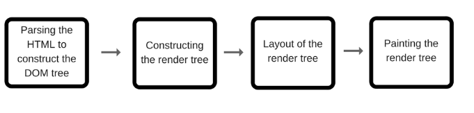
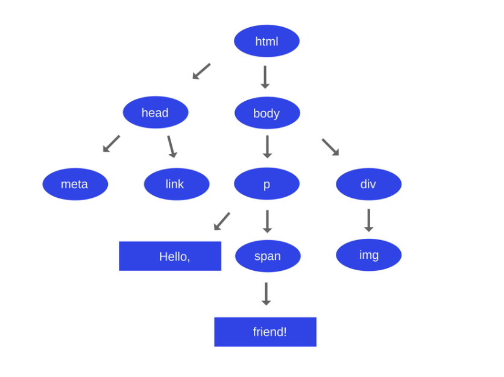
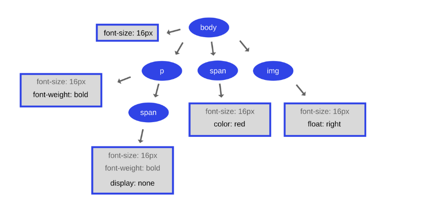
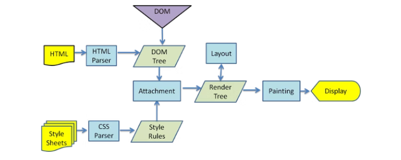
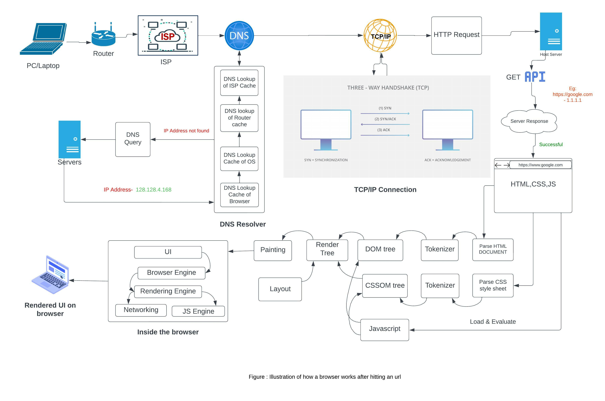

# How a Browser works after entering the url...

## Table of contents

- [Introduction](#introduction)
- [What happens after hitting the url](#what-happens-after-hitting-the-url)
- [What is the main functionality of a browser](#what-is-the-main-functionality-of-a-browser)
- [High level components of a browser](#high-level-components-of-a-browser)
- [Rendering engine and its use](#rendering-engine-and-its-use)
- [Tree construction](#tree-construction)
- [Order of script processing](#order-of-script-processing)
- [Layout and painting](#layout-and-painting)
- [Diagram](#diagram)

### Introduction

In this fast moving world without using web browser/internet nothing goes forward.We generally use web browser for reading,writing,chating and etc.

Everything we do on a browser is a page,technically a web pagerendered in html.Have you ever wondered what magic happens behind the scenes.

In about 5-10 min you will have a brief idea of how the browser works and renders when you enter an url.

### What happens after hitting the url

**Step1 :** Suppose you type `netflix.com` in the address bar of your browser.The browser tries to get the `IP address` by trying to reach the server where the website is hosted.

**Step2 :** The browser looks for the ip address of the domain name in DNS(**Domain Name Server**)

DNS is a list of urls with ip address mapped just like a telephone directory. So DNS checks at the following places to pull the ip address.

- **DNS Lookup for Browser Cache:** The browser maintains the cache of dns records. DNS query is first run over here.
- **DNS Lookup for OS Cache:** If the browser doesn't return any output then it checks in OS cache.
- **DNS Lookup for Router Cache:** If the pc doesn't return any form of dns cached records then dns query is run on router cache.
- **DNS Lookup for ISP Cache:** ISP is called as `Internet service provider` for example airtel,jio fiber etc.If IP address is not returned form the above three methods then we look at ISP cache of DNS records and yet if we are not successful then ISP's DNS search is initated and runs a DNS query which communicates to several other servers like amazon,google,facebook etc to get the ip address of website hosted.

So, the domain name which you entered returned an IP address of the domain. Suppose the above-entered domain name `netfix.com` has an IP address `1.128.128.1`
So, if we type `https://1.128.128.1` in the browser we can reach the website.

In a nutshell, DNS is something which takes domain name as input and returns the ip address of the website.

**Step3 :** Once we are successful in step 2 and assuming we have the ip address of the website ,the browser initiates a **TCP connection with the server**

Here browser tries to establish a connection with the server using internet protocol. The most common protocol used is TCP protocol,and it is a 3-way hand shake protocol and 3 step process.

- **Step 1 (SYN):** As the client wants to establish a connection so it sends an SYN(Synchronize Sequence Number) to the server which informs the server that the client wants to start a communication.
- **Step 2 (SYN + ACK):** If the server is ready to accept connections and has open ports then it acknowledges the packet sent by the server with the SYN-ACK packet.
- **Step 3 (ACK): In the** last step, the client acknowledges the response of the server by sending an ACK packet. Hence, a reliable connection is established and data transmission can start now.

**Step4 :** Once the connection has been established now the browser tries to send get api request to the server where the website is hosted.

Now the browser sends the information like request header `User-Agent` which allows the client to pass information about the request, and about the client itself, to the server.Other header fields like `Accept-Language` are added to form a http request.Sample example of HTTP get requestis shown below.

```

Request URL: https://www.netflix.com/
Request Method: GET
Status Code: 302
Remote Address: [2600:1f14:62a:de84:880a:88cc:a16:5423]:443
Referrer Policy: strict-origin-when-cross-origin
cookie: xyz
user-agent: Mozilla/5.0 (X11; Linux x86_64) AppleWebKit/537.36 (KHTML, like Gecko) Chrome/104.0.5112.79 Safari/537.36


```

**Step 5** : Now the server where the website is hosted sends the response with the status code. If status code is 2XX then it is successful.

**Step 6** : Now the browser gets the response and the HTML web page is rendered in phases. First, it gets the HTML structure and then it sends multiple GET requests to get the embedded links, images, CSS, javascript files, etc and other stuff. The web page will be rendered and in this case, the `netflix` web page will be displayed.

The complete process is illustrated in the [Diagram](#diagram).

Are you wondering how the browser reads the html,css and js and other files that we received from the server. Let us get into these details.

### What is the main functionality of a browser

Browser main function is to fetch the web pages from the server along with the necessary files like images, html,css,videos etc, interprets them and then displays it on the screen.

There are many similarities between browser user interfaces. Among the typical components of user interfaces are:

- Address bar for inserting a URI which is a unique resource identifier and superset of URL.
- Arrows icons to move back and forward
- Bookmarking options
- Refresh and stop buttons for refreshing or stopping the loading of current documents
- Home button that takes you to your home page

### High level components of a browser

- **The user interface:** this is mainly composed of the bookmarking menu, back/forward buttons, address bar, etc. 
- **Browser Engine:** Between the user interface and the rendering engine, the browser engine marshals operations.
- **Render Engine:** The rendering engine is in charge of presenting the requested content. When HTML content is requested, for instance, the rendering engine parses HTML and CSS and displays the - -result on the screen.
- **Networking:** For network calls like HTTP requests, several platform-specific implementations are used behind a platform-independent interface.
- **UI Backend:** Basic widgets like combo boxes and windows are drawn using the UI backend. This backend presents a universal, cross-platform interface. It employs techniques for the operating system user interface underneath.
- **JavaScript interpreter:** Used to parse and execute JavaScript code.
- **Data storage** All kinds of data, such as cookies, may need to be stored locally by the browser. Additionally, storage systems like localStorage, IndexedDB, WebSQL, and FileSystem are supported by browsers.

### Rendering engine and its use

The main purpose of the rendering engine is to display the requested web page on the screen.

Rendering engines can display HTML and XML documents and images. If you’re using additional plugins, the engines can also display different types of documents such as PDF.

Few examples of rendering engines are

- Gecko - Firefox
- Webkit - Safari
- Blink - Chrome/Chromium(a fork of webkit)

**Rendering Flow **

The rendering engine receives the contents of the requested document from the networking layer.



The HTML page is parsed in the first step of the rendering engine, and the parsed elements are then transformed into real DOM nodes in a DOM tree.

**Parsing**

Translating the document to a structure where the code can understand and use.

- **HTML Parsing:** The job of the HTML parser is to parse the HTML markup into a parse tree. HTML parsing algorithm consists of two stages: tokenization and tree construction.

Tokenization is the lexical analysis, parsing the input into tokens. Among HTML tokens are start tags, end tags, attribute names and attribute values. The tokenizer recognizes the token, gives it to the tree constructor, and consumes the next character for recognizing the next token, and so on until the end of the input.

- **CSS Parsing:** CSS Selectors are matched by browser engines from right to left. A selector's specificity is calculated as mentioned below.

  1. Count 1 if the declaration it is from is a 'style' attribute rather than a rule with a selector, 0 otherwise
  2. Count the number of ID selectors in the selector
  3. Count the number of class selectors, attributes selectors, and pseudo-classes in the selector
  4. Count the number of element names and pseudo-elements in the selector
  5. Ignore the universal selector

### Tree construction

Let us understand the tree construction by an example.
Consider the html file as shown below.

```

<html>
  <head>
    <meta charset="UTF-8">
    <link rel="stylesheet" type="text/css" href="index.css">
  </head>
  <body>
    <p> Hello, <span> friend! </span> </p>
    <div>
      
    </div>
  </body>
</html>

```

**Constructing the dom tree**

image of html dom tree



All of the elements that are directly contained within of each element are essentially represented as its parent nodes. Additionally, this process is used recursively.

**Constructing the cssom tree**

Let us say if the the browser is in a process of constructing a dom tree and it encountered a style link in the head tag . So the browser anticipates that there could be another resource to render the pafe and it immediately sends a request.Let us consider index.css file for our html file.

```
body {
  font-size: 16px;
}

p {
  font-weight: bold;
}

span {
  color: red;
}

p span {
  display: none;
}

img {
  float: right;
}


```



**Rendered Tree**

Render tree is the visual elements constructed in the order in which they will be displayed on the screen. It is the visual representation of the HTML along with the corresponding CSS. The purpose of this tree is to enable painting the contents in their correct order.

Each node in the render tree is known as a renderer or a render object in Webkit.

This is how the renderer tree of the above DOM and CSSOM trees will look like:



### Order of script processing

Scripts are parsed and executed immediately when the parser reaches a `<script/>` tag. The parsing of the document halts until the script has been executed. This means that the process is synchronous.

If the script is external then it first has to be fetched from the network (also synchronously). All the parsing stops until the fetch completes.

HTML5 adds an option to mark the script as asynchronous so that it gets parsed and executed by a different thread.

### Layout and painting

- **Layout Tree**

When the renderer is created and added to the tree, it does not have a position and size. Calculating these values is called layout.

HTML uses a flow-based layout model, meaning that most of the time it can compute the geometry in a single pass. The coordinate system is relative to the root renderer. Top and left coordinates are used.

Layout is a recursive process — it begins at the root renderer, which corresponds to the `<html>` element of the HTML document. Layout continues recursively through a part or the entire renderer hierarchy, computing geometric info for each renderer that requires it.

The position of the root renderer is `0,0` and its dimensions have the size of the visible part of the browser window (a.k.a. the viewport).

Starting the layout process means giving each node the exact coordinates where it should appear on the screen.

- **Painting Tree**

  In this stage, the renderer tree is traversed and the renderer’s `paint()` method is called to display the content on the screen.

  1.  Painting can be global or incremental (similar to layout):

  2.  Global — the entire tree gets repainted.

Incremental — only some of the renderers change in a way that does not affect the entire tree. The renderer invalidates its rectangle on the screen. This causes the OS to see it as a region that needs repainting and to generate a paint event. The OS does it in a smart way by merging several regions into one.

In general, it’s important to understand that painting is a gradual process. For better UX, the rendering engine will try to display the contents on the screen as soon as possible. It will not wait until all the HTML is parsed to start building and laying out the render tree. Parts of the content will be parsed and displayed, while the process continues with the rest of the content items that keep coming from the network.

### Diagram


